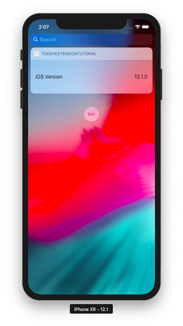

# TodayExtensionTutorial

## Build and Run

Open the project with Xcode, change the Target to `TodayExtensionTutorial` and Build and Run the project, In the Today's Notification section the Extension will be displayed.

